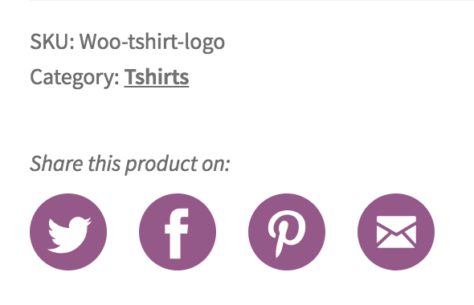
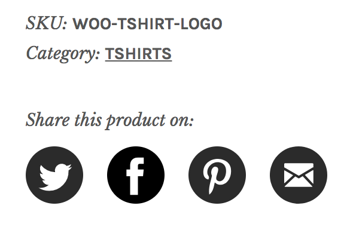

# Polaris Product Sharing

- Contributors: skymaiden, jameskoster, woothemes, tiagonoronha,
- Tags: woocommerce, ecommerce, storefront, social, sharing, seo
- Requires at least: 3.5
- Tested up to: 4.9
- Stable tag: 1.0
- License: GPLv2 or later
- License URI: http://www.gnu.org/licenses/gpl-2.0.html

Add attractive social sharing icons for Facebook, Twitter, Pinterest and Email to your product pages. 

*A fork of [Storefront Product sharing](https://github.com/woocommerce/storefront-product-sharing).*

## Description

A simple plugin that adds an attractive sharing component to product pages. Prompt visitors to share your products on Facebook, Twitter, Pinterest or via Email.

This plugin requires the Storefront theme and WooCommerce plugin to be installed.

## Installation

1. Upload `polaris-product-sharing` to the `/wp-content/plugins/` directory
2. Activate the plugin through the 'Plugins' menu in WordPress
3. Done!

## Frequently Asked Questions

**I installed the plugin but cannot see the sharing buttons**

This plugin will only work with the [Storefront](http://wordpress.org/themes/storefront/) theme and the [WooCommerce](http://wordpress.org/plugins/woocommerce/) plugin.

## Screenshots

1. The sharing buttons in action on the Storefront theme.

2. The sharing buttons in action on the Galleria child theme.

## Changelog

**1.0 - 27.06.2018**

Initial release.
